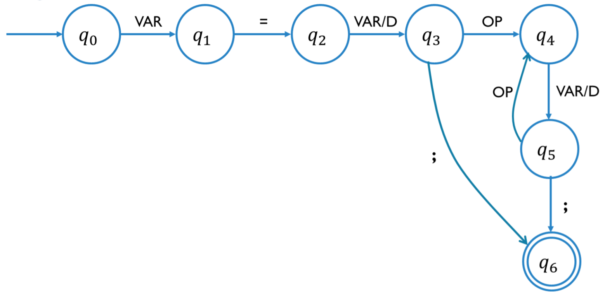

# Finite-state Machine

Evaluate expressions that match the regular expression **`VAR=(VAR/D) (OP (VAR/D))`**

## Alphabet

- **Σ = {VAR, D, OP, =, ;}** is the alphabet, described below:
  - **VAR= {a, b}**
  - **D= {0, 1, 2, 3, 4, 5, 6, 7, 8, 9}**
  - **OP= {+, -, \*, /}**
- **E = {q0, q1, q2, q3
  , q4, q5, q6}**
  is the set of states.
- **S = q0** is the initial state.
- **F = q6** is the final state.
- **δ: Σ × Σ → Σ** is the function to determine the next state.

## Diagram

## Table

| δ             | VAR           | D             | OP            | =             | ;             |
| ------------- | ------------- | ------------- | ------------- | ------------- | ------------- |
| q0 | q1 | -1            | -1            | -1            | -1            |
| q1 | -1            | -1            | -1            | q2 | -1            |
| q2 | q3 | q3 | -1            | -1            | -1            |
| q3 | -1            | -1            | q4 | -1            | q6 |
| q4 | q5 | q5 | -1            | -1            | -1            |
| q5 | -1            | -1            | q4 | -1            | q6 |

**_Note:_** _for programming purposes, the -1 would be an error in the analyzed string._

## Resources

- [Vue.js](https://vuejs.org/)
- [Vue router](https://router.vuejs.org/)
- Font: [Saira](https://fonts.google.com/specimen/Saira)
- Icons: [Boxicons](https://boxicons.com/)
